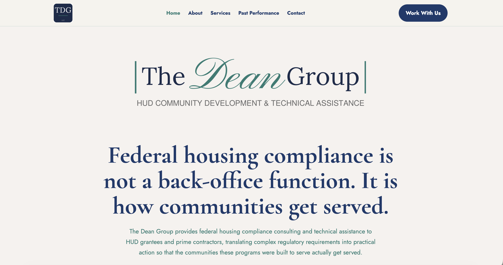

# The Dean Group Website



Official website for **The Dean Group, LLC**, a HUD Community Planning and Development (CPD) compliance consulting firm providing technical assistance, regulatory compliance, training, and strategic advisory services to public agencies, nonprofit organizations, and affordable housing stakeholders.

**Live Website:** https://thedeangroup.llc

---

## Overview

This repository contains the complete source code for The Dean Group website.

The site was designed as a lightweight, high-performance static website that showcases the firm's services, experience, qualifications, and representative work while remaining simple to maintain and deploy.

---

## Website Structure

```
/
├── index.html                  Home
├── about.html                  About
├── services.html               Services
├── past-performance.html       Past Performance
├── contact.html                Contact
│
├── assets/
│   ├── documents/
│   ├── logos/
│   ├── photos/
│   └── icons/
│
├── css/
│   └── styles.css
│
└── js/
    └── main.js
```

---

## Features

- Fully responsive design
- Mobile navigation
- Custom branding and typography
- Internal page and section navigation
- Qualifications Package download
- Representative Past Performance portfolio
- Contact form integration
- GitHub Pages hosting
- Lightweight HTML/CSS/JavaScript architecture

---

## Technology Stack

- HTML5
- CSS3
- Vanilla JavaScript
- Git
- GitHub Pages

---

## Local Development

Clone the repository:

```bash
git clone git@github.com:TheDeanGroupLLC/TheDeanGroupLLC.github.io.git
```

Open the project in Visual Studio Code and launch using Live Server (recommended), or simply open `index.html` in your browser.

---

## Deployment

The website is hosted using **GitHub Pages**.

Changes pushed to the `main` branch are automatically published to:

https://thedeangroup.llc

---

## Repository

```
TheDeanGroupLLC.github.io/

assets/
css/
js/

index.html
about.html
services.html
past-performance.html
contact.html
README.md
```

---

## Maintenance

When making updates:

1. Pull the latest changes from the `main` branch.
2. Make edits locally.
3. Test all modified pages.
4. Commit changes with a descriptive commit message.
5. Push to the `main` branch.
6. Verify the deployment on GitHub Pages.
7. Confirm changes are live at https://thedeangroup.llc.

---

## Contact

**The Dean Group, LLC**

Website: https://thedeangroup.llc

Email: Andelyn@TheDeanGroup.llc

---

## Copyright

© The Dean Group, LLC. All rights reserved.

The contents of this repository, including website design, text, graphics, branding, publications, and supporting materials, are proprietary to The Dean Group, LLC. No portion may be reproduced or distributed without prior written permission.
